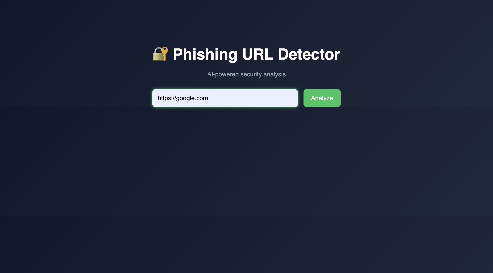
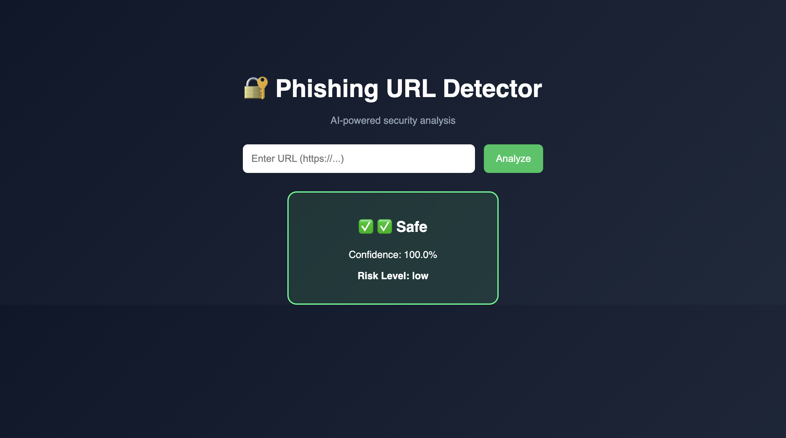
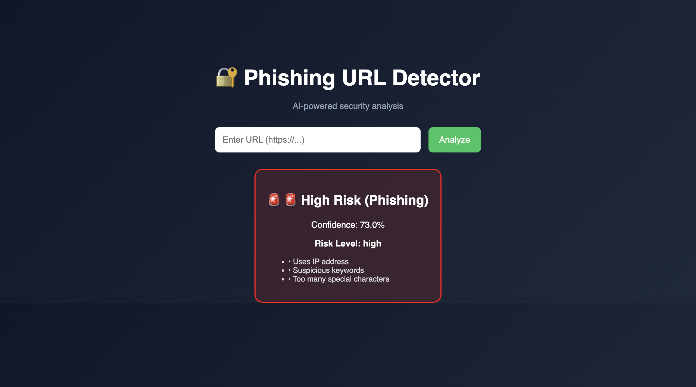
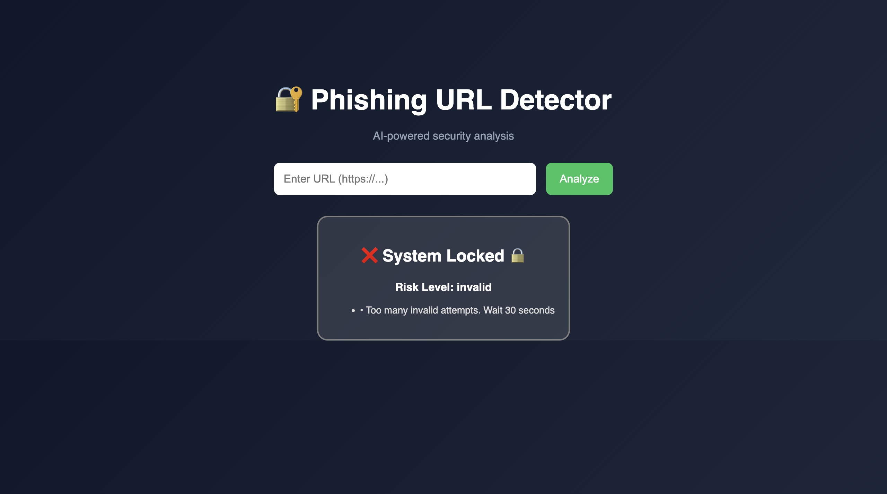

# 🔐 AI-Based Phishing URL Detection System


---

## 🚀 Overview

An intelligent web-based system that detects whether a URL is **Safe**, **Suspicious**, or **Phishing** using a combination of:

* 🤖 Machine Learning
* 🧠 Feature Engineering
* ⚠️ Risk Scoring
* 🔐 Security Controls (Lock System)
* 🎨 Interactive Dashboard

---

## 🖼️ Demo / Screenshots

### 🔍 Input Interface



### ✅ Safe URL Detection



### 🚨 Phishing Detection



### 🔒 System Lock Mechanism




## 🎯 Features

### 🧠 Machine Learning Detection

* Random Forest Classifier
* Predicts Safe / Suspicious / Phishing

### 🔍 Feature Extraction

* URL length, subdomains
* IP address detection
* Suspicious keywords
* Special characters
* Fragment (`#`) handling

### ⚖️ Risk Scoring

* Combines heuristic + ML
* Improves detection realism

### 🔐 Security Lock System

* Tracks repeated invalid inputs
* Locks system after 3 failed attempts
* Auto-unlock after 30 seconds

### 🎨 Interactive UI

* Animated results
* Loader spinner
* Risk highlighting
* Confidence score display

---

## 🏗️ Project Structure

```id="projstruct01"
phishing-detector/
│
├── app.py
├── model.py
├── features.py
├── dataset.csv
├── model.pkl
│
├── templates/
│   └── index.html
│
├── static/
│   └── style.css
│
├── images/          # screenshots here
├── requirements.txt
└── README.md
```

---

## ⚙️ How It Works

```id="flow01"
User Input URL
        ↓
Validation
        ↓
Feature Extraction
        ↓
Risk Scoring
        ↓
ML Prediction
        ↓
Final Result (Safe / Suspicious / Phishing)
```

---

## ▶️ Run Locally

```id="run01"
git clone <your-repo-link>
cd phishing-detector
python3 -m venv venv
source venv/bin/activate
pip3 install flask pandas scikit-learn
python3 model.py
python3 app.py
```

Open:

```id="run02"
http://127.0.0.1:5000
```

---

## 🧠 Tech Stack

* Python
* Flask
* Scikit-learn
* Pandas
* HTML/CSS

---

## ⚠️ Limitations

* Small dataset
* No real-time threat intelligence
* Static ML model

---

## 🔮 Future Improvements

* Live URL scanning
* Deep learning models
* Domain reputation APIs
* Real-time lock countdown UI

---

## 🎓 Learning Outcomes

* ML in cybersecurity
* Feature engineering
* Web + ML integration
* Security concepts (rate limiting, validation)

---

## 📌 Conclusion

A **mini real-world phishing detection system** combining **AI + security engineering + UI design**.

---

## 👨‍💻 Author

Shreyash Singh ,
B.Tech CSE (AI/ML)
